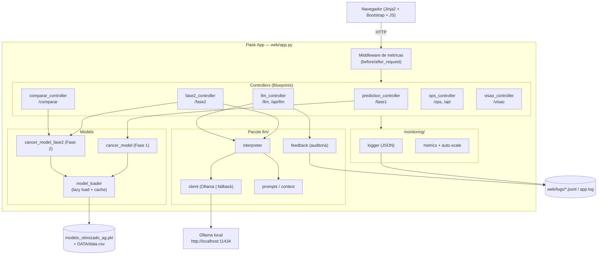
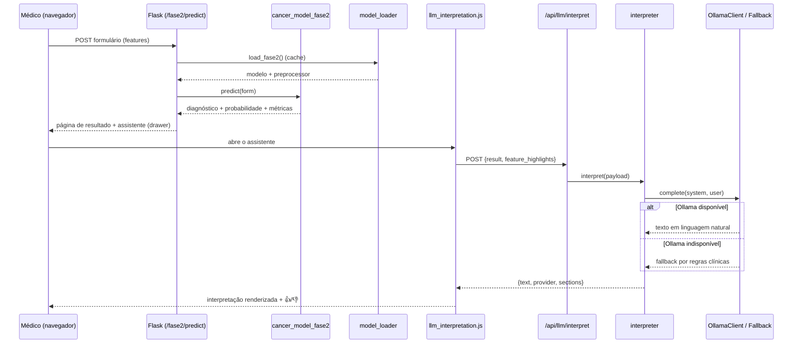
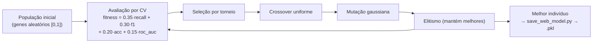
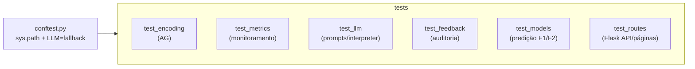

# Arquitetura — Tech Challenge Fase 2

## Visão geral

A Fase 2 estende a aplicação web Flask do Módulo 1 com:

1. **Módulo 2 (AG)** — predição com modelo KNN otimizado por Algoritmo Genético
2. **Comparação** — execução lado a lado dos dois modelos no mesmo input
3. **Assistente LLM** — interpretação em linguagem natural + chat (Ollama local)
4. **Monitoramento** — logging estruturado, métricas e auto-scaling simulado
5. **Identidade visual** — Fase 1 (vermelho) vs Fase 2 (roxo) para comparação clara

## Diagrama de componentes



## Fluxo de predição + interpretação (Módulo 2)



## Rotas

| Rota | Módulo | Descrição |
|------|--------|-----------|
| `/` | Hub | Página inicial com links F1, F2, Comparar |
| `/fase1`, `/fase1/predict` | Módulo 1 | Modelo baseline (hiperparâmetros fixos) |
| `/fase1/exemplos` | Módulo 1 | Casos reais rotulados |
| `/fase2`, `/fase2/predict` | Módulo 2 | Modelo otimizado por AG + interpretação LLM |
| `/comparar`, `/comparar/predict` | Comparação | Ambos os modelos no mesmo exame |
| `/llm/avaliacao` | LLM | Rubrica heurística de qualidade |
| `/llm/auditoria` | LLM | Curadoria dos feedbacks dos médicos |
| `/api/llm/interpret`, `/api/llm/chat`, `/api/llm/feedback`, `/api/llm/status` | LLM | Endpoints JSON |
| `/ops/monitoramento` | Ops | Dashboard de métricas |
| `/api/health`, `/api/metrics` | Ops | Health check e snapshot JSON |
| `/visao/*` | Visão | Gestos (inalterado) |

## Algoritmo Genético (Módulo 2)



- **Codificação** (`encoding.py`): vetor de floats `[0,1]`, um gene por hiperparâmetro; decodificação por interpolação linear/logarítmica e escolha categórica.
- **Aptidão** (`fitness.py`): validação cruzada, priorizando **recall** (evitar falsos negativos em rastreamento).
- **Configurações** (`config.py`): 3 experimentos com população/mutação/gerações distintas.

## Decisões de implementação

### Separação Fase 1 vs Fase 2

- **Fase 1** mantém o fluxo original com prefixo `/fase1` e tema vermelho FIAP.
- **Fase 2** usa hero roxo, badge `MÓDULO 2 — ALGORITMO GENÉTICO` e a interpretação LLM.
- A página **Comparar** exibe resultados em duas colunas com bordas coloridas.

### Carregamento de modelos

`model_loader.py` usa cache thread-safe:

- Fase 1 treina **KNN baseline** com `BASELINE_HYPERPARAMS["KNN"]` (ou carrega `.pkl` se existir).
- Fase 2 carrega `resultados/otimizacao_genetica/notebook/modelo_otimizado_ag.pkl`.
- Regenerar Fase 2: `python -m otimizacao_genetica.save_web_model`

### Assistente LLM

- Roda **localmente via Ollama** (`FIAP_LLM_PROVIDER=ollama`); ver [`ARQUITETURA_LLM.md`](ARQUITETURA_LLM.md).
- Degrada com elegância para **interpretação por regras** se o Ollama estiver indisponível.
- Feedback dos médicos (👍/👎 + motivo + tags) alimenta a página de **auditoria/curadoria**.

### Monitoramento e logging

- **Logs**: JSON em `web/logs/app.log` via `monitoring/logger.py`.
- **Métricas**: contadores em memória (`request_count`, `prediction_count`, latência média/p95, taxa de erro).
- Middleware em `app.py` mede a latência de cada requisição.

### Auto-scaling (simulado)

`MetricsStore` ajusta `workers` conforme `active_requests`:

| Variável de ambiente | Padrão | Função |
|---------------------|--------|--------|
| `FIAP_MIN_WORKERS` | 2 | Mínimo de workers |
| `FIAP_MAX_WORKERS` | 8 | Máximo de workers |
| `FIAP_SCALE_UP_RPS` | 5 | Escala para cima se requisições ativas ≥ limiar |
| `FIAP_SCALE_DOWN_RPS` | 2 | Escala para baixo se requisições ativas ≤ limiar |

> O auto-scale é **demonstrativo** — o valor de workers aparece no dashboard `/ops/monitoramento`. Em produção real, usar Kubernetes HPA ou similar com métricas externas.

## Testes automatizados

Suíte pytest em `tests/` (ver README, seção *Testes*). Os testes de LLM rodam offline (provedor `fallback`), garantindo determinismo e independência de rede.



## Como executar localmente

```powershell
cd Fase_2
.venv\Scripts\activate   # Windows
python web/app.py
```

Acesse: http://localhost:5000

## Comparação de modelos

A tabela em `/comparar` lê `resultados/otimizacao_genetica/notebook/comparacao_anterior_vs_otimizado.csv` (gerada pelo notebook).

Na predição, `predict_compare()` executa Fase 1 e Fase 2 e retorna concordância/divergência de diagnóstico e diferença de probabilidade.
