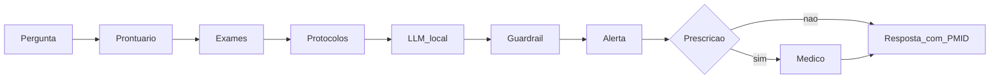

# Relatório técnico — Tech Challenge Fase 3

Assistente clínico com fine-tuning no PubMedQA, orquestração LangGraph e inferência local via Hugging Face Transformers (PyTorch CUDA). Sem Ollama. Continua o hospital das Fases 1 e 2 (cópia autônoma nesta pasta; a Fase 2 original não foi alterada).

## Fine-tuning

- Base treinada: `Qwen/Qwen2.5-3B-Instruct` (o Llama 3.2 é gated sem `HF_TOKEN`). Template ChatML.
- Técnica: QLoRA (r=32, alpha=64, 4-bit NF4, 1 época, teto 500 no artificial). Loss e accuracy saem do notebook depois do treino.
- Dados: PubMedQA (artificial yes/no equilibrado, teto 500) + labeled de treino + 27 exemplos de protocolo/FAQ/laudo (repetidos no loader). Holdout labeled (500) fora do SFT. O treino usa o JSONL inteiro.
- Inferência: Transformers no processo, pesos em `C:\workspace\Modelos`, adapter em `models/adapter`. Sem Ollama.

A narrativa, o treino QLoRA e as métricas (accuracy, macro-F1, matriz) estão em [Analise/assistente_clinico.ipynb](../Analise/assistente_clinico.ipynb).

## Assistente

O grafo (`assistant/graph.py`) faz: classificar pedido → carregar prontuário → exames pendentes → recuperar protocolo → gerar rascunho → validar → alertar → pausar se for prescrição → responder com PMID.

Guardrails em duas camadas (regex no pedido e na resposta). Sem fonte, o parecer não é publicado. Alertas ficam no SQLite e não duplicam no mesmo thread.

## Diagrama

## Avaliação

| Frente | Resultado |
| --- | --- |
| Accuracy / macro-F1 (holdout 500) | Gerados no notebook após `evaluate --generate --limit 500` |
| RAG recall@3 | **1.0** (5/5) |
| Guardrail | **1.0** (10/10) |

Accuracy e macro-F1 base vs fine-tuned ficam no notebook depois do treino. RAG e guardrail não dependem da GPU.

## Limitações

Apoio educacional. Não diagnostica, não prescreve e não substitui julgamento médico. O PubMedQA é em inglês; a interface é em português. Pacientes são sintéticos e anonimizados.
